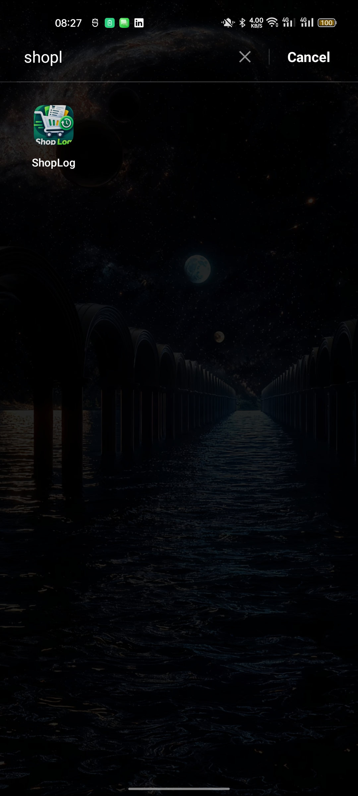
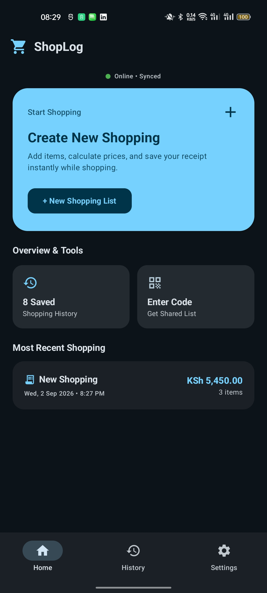
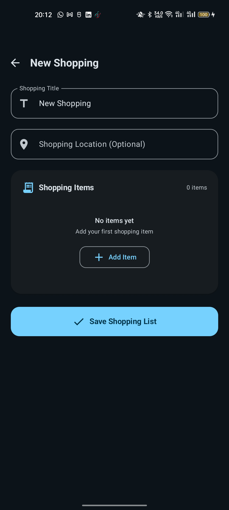
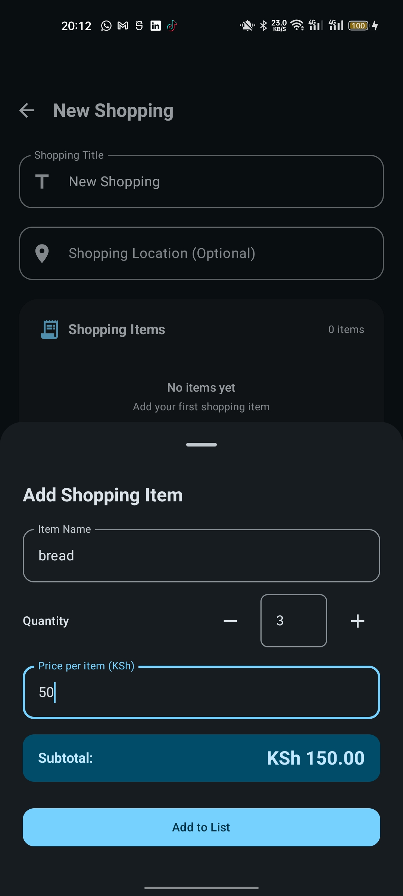
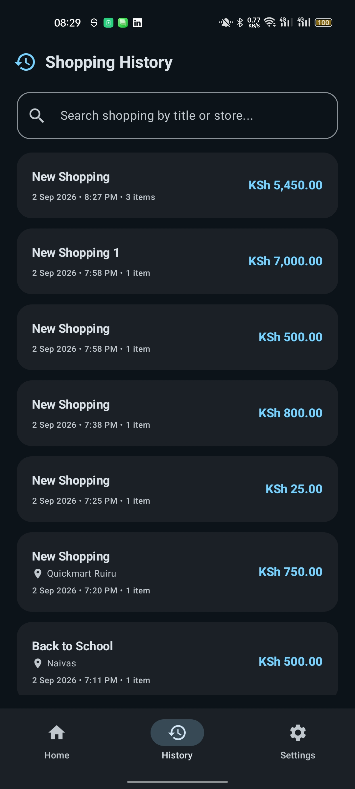
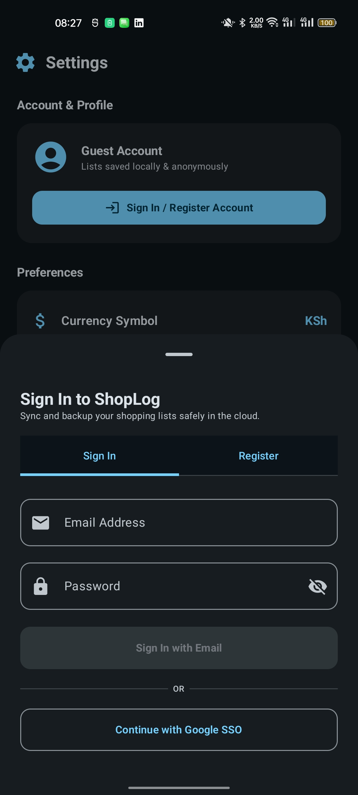
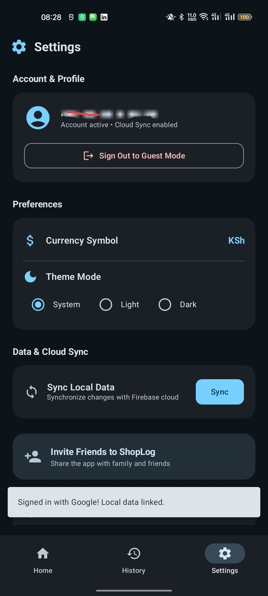

<p align="center">
  
</p>

# ShopLog

ShopLog is a modern, offline-first Android application designed to streamline shopping, calculate item subtotals and totals in real-time with integer-cent accuracy, generate digital receipts, and synchronize shopping lists across devices.

Built with modern Android engineering practices including Jetpack Compose, Material Design 3, Dagger Hilt, Room Database, and Firebase (Cloud Firestore & Authentication).

---

## Key Features

- **Offline-First Architecture**: Create, edit, and view shopping lists without an active internet connection. All changes persist locally using Room and synchronize automatically to Cloud Firestore once connection is restored.
- **Real-Time Price & Total Calculation**: Prevents rounding errors during checkout using exact integer-cent arithmetic (`Money` utility). Calculates individual item subtotals and overall grand total dynamically.
- **Digital Receipt View**: Displays shopping lists in a clean, itemized digital receipt card format with quantity, unit price, subtotal, and store location details.
- **Unfinished Draft Recovery**: Automatically captures uncommitted shopping lists so users can resume shopping seamlessly.
- **Short Code Sharing**: Generate unique 7-character alphanumeric share codes (e.g., `AUG123D`) for any shopping list. Anyone with the code can retrieve and view the shared list on their device or save a personal copy.
- **Barcode Product Scanning**: Scan physical product barcodes directly when adding items to automatically identify and populate products.
- **Smart Item Suggestions & Auto-Complete**: Search and auto-complete common grocery items as you type with instant suggestion chips.
- **Import & Export to CSV / Excel**: Import shopping list items from CSV files and export itemized receipt spreadsheets directly to Excel or Google Sheets.
- **Physical Receipt Photo Attachment**: Attach and store photos of physical store receipts directly to shopping lists for future reference.
- **Month-Grouped Shopping History**: Archive past shopping receipts automatically categorized by month headers (e.g. September 2025) displaying total monthly expenditure alongside instantaneous keyword search.
- **Expenditure Analytics**: Dedicated Analytics dashboard displaying current month expenditure, all-time total expenditure in side-by-side cards, and a monthly expenditure breakdown. Users can click any month to view a detailed breakdown of all receipts for that month.
- **Flexible Authentication & Migration**: Supports Guest (Anonymous) mode, Email/Password, and Google Sign-In via Credential Manager API. Local anonymous shopping lists automatically re-assign and migrate upon signing in.
- **Multi-Currency & Customization**: Supports multiple currency symbols (KSh, $, €, £, ₹, ₦, R, UGX, TZS) and theme preferences (Light, Dark, System default).

---

## App Screenshots

### Core Experience

| Home Dashboard | Shopping List & Receipt | Add / Edit Item |
|:---:|:---:|:---:|
|  |  |  |

### History, Accounts & Settings

| Shopping History | Account & Authentication | Preferences & Theme |
|:---:|:---:|:---:|
|  |  |  |

---

## Technical Stack & Architecture

ShopLog is engineered following modern Android development guidelines and clean architectural principles:

- **UI Framework**: Jetpack Compose with Material Design 3 (Material3) and Material Icons Extended.
- **Architecture**: MVVM (Model-View-ViewModel) + Unidirectional Data Flow (UDF).
- **Dependency Injection**: Dagger Hilt (`@HiltAndroidApp`, `@HiltViewModel`).
- **Local Persistence**: Room Database with Flow observables and KSP compiler.
- **Cloud Infrastructure**: Firebase Authentication (Anonymous, Email, Google Provider) & Cloud Firestore.
- **Asynchronous Processing**: Kotlin Coroutines and StateFlow / SharedFlow.
- **Network State Observer**: Live network connectivity monitoring using Android `ConnectivityManager` callbacks.
- **Build System**: Gradle Kotlin DSL (`build.gradle.kts`) with Version Catalogs.

---

## Project Structure

```
com.example.shoplog/
├── core/
│   ├── model/
│   │   └── SyncStatus.kt           # Sync state tracking enum (SYNCED, PENDING_CREATE, etc.)
│   └── util/
│       ├── Money.kt                # Integer-cent math calculations & formatting
│       ├── NetworkMonitor.kt       # Real-time network connectivity flow listener
│       └── ShareCodeGenerator.kt   # 7-character short code generator and validator
├── data/
│   ├── local/
│   │   ├── dao/ShoppingDao.kt      # Room Database access operations
│   │   ├── entity/                 # Room entities (ShoppingListEntity, ShoppingItemEntity)
│   │   └── ShopLogDatabase.kt      # Room Database definition
│   ├── remote/
│   │   └── FirebaseSyncManager.kt  # Background synchronization engine for Cloud Firestore
│   └── repository/
│       ├── AuthRepository.kt       # Firebase Authentication & account linking logic
│       └── ShoppingRepository.kt   # Single source of truth for shopping lists & items
├── di/
│   └── DatabaseModule.kt           # Hilt Dependency Injection module for database & DAOs
└── ui/
    ├── components/                 # Reusable Compose UI components (ReceiptCard, BottomSheets)
    ├── navigation/                 # NavGraph and Screen route definitions
    ├── screens/
    │   ├── analytics/              # Expenditure analytics & monthly detail views
    │   ├── auth/                   # Authentication viewmodels and bottom sheets
    │   ├── details/                # Saved receipt and details view
    │   ├── history/                # Month-grouped history list and search view
    │   ├── home/                   # Primary dashboard view
    │   ├── settings/               # App configuration and preferences
    │   ├── share/                  # Sharing & retrieve code dialogs
    │   └── shopping/               # Interactive shopping list creator & editor
    └── theme/                      # Color palettes, typography, and Material Theme setup
```

---

## Data Flow & Synchronization

1. **Local-First Writes**: When a user creates or modifies a list/item, the operation is written directly to the local Room database with a `SyncStatus` flag (`PENDING_CREATE`, `PENDING_UPDATE`, or `PENDING_DELETE`).
2. **Background Sync Engine**: `FirebaseSyncManager` listens for network connectivity and executes batched synchronization calls to Cloud Firestore.
3. **Conflict-Free Updates**: Once Firestore confirms document creation or deletion, local database records transition to `SYNCED`.
4. **Account Migration**: When signing in from guest mode, `AuthRepository` executes `reassignListOwner()`, seamlessly attaching all existing local lists to the authenticated user ID before triggering cloud synchronization.

---

## Download APK

You can download the latest compiled ShopLog Android APK directly to install on any Android device (Android 7.0+ / API 24+):

- **Latest Releases & APK**: [https://github.com/Gmmaina/ShopLog/releases](https://github.com/Gmmaina/ShopLog/releases)

---

## Getting Started

### Prerequisites

- Android Studio Ladybug (2024.2.1) or newer
- JDK 17
- Android SDK version 37 (Minimum SDK version 24)

### Setup Instructions

1. **Clone the repository**:
   ```bash
   git clone git@github.com:Gmmaina/ShopLog.git
   cd ShopLog
   ```

2. **Configure Firebase**:
   - Create a project in the Firebase Console.
   - Enable **Firebase Authentication** (Anonymous, Email/Password, and Google Sign-In).
   - Enable **Cloud Firestore** in production or test mode.
   - Download `google-services.json` and place it in the `app/` directory.

3. **Build and Run**:
   - Open the project in Android Studio.
   - Sync Gradle project files.
   - Select an emulator or physical device running Android 7.0 (API 24) or higher.
   - Click **Run** or execute via CLI:
     ```bash
     ./gradlew assembleDebug
     ```

---

## License

```
Copyright 2025 ShopLog

Licensed under the Apache License, Version 2.0 (the "License");
you may not use this file except in compliance with the License.
You may obtain a copy of the License at

    http://www.apache.org/licenses/LICENSE-2.0

Unless required by applicable law or agreed to in writing, software
distributed under the License is distributed on an "AS IS" BASIS,
WITHOUT WARRANTIES OR CONDITIONS OF ANY KIND, either express or implied.
See the License for the specific language governing permissions and
limitations under the License.
```
